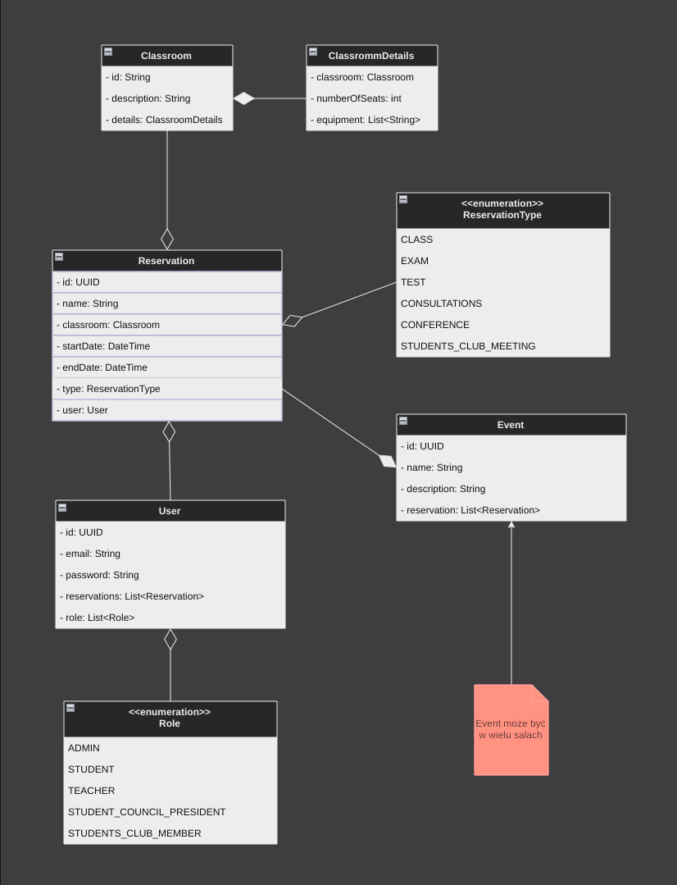

# 🔵 D17Map - Backend Side 🗺 🔍


## 🔷 How to run?
### 🔹 Setup
Before running any of the following commands, you should create a `.env` file
in the same directory as `docker-compose.yaml`. The `.env` file should
contain your password to the database:


#### .env
```text
DB=<your_postgres_db>
USER=<your_postgres_user>
PASSWORD=<your_password>
```


### 🔹 Commands
The following commands should be issued from the root directory of the project.

1. `docker compose build`
2. `docker compose up -d`


### Auto-reload
To be able to use auto reload, after running `docker compose up`, the following commands should be issued
another terminal:
1. `docker exec -t -i ktor bash`
2. `./gradlew build -t` or `./gradlew build -t -x test` if you want to skip tests

Now, every time a watched file is changed, (`ctrl + s`), application is rebuilt and after a couple of seconds
changes are applied.


## 🔷 Cleaning Docker
Sometimes docker has problems with itself, but there is a couple of commands which you can try to fix it

1. `docker compose down -v` - this command stops containers and removes them.
2. `docker system prune` - removes all dangling/untagged resources
3. `docker system prune -a` - removes a little bit more ;)
4. `docker volume rm <your volume name>` - obvious (use `docker volume ls` to list all volumes)
5. `docker volume prune` - removes all dangling volumes

Other useful commands may be found [here](https://contabo.com/blog/how-to-remove-docker-volumes-images-and-containers/)


## Object model

> Note: This is the old one!



